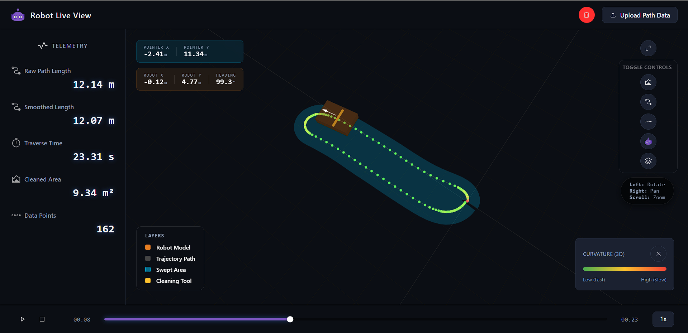
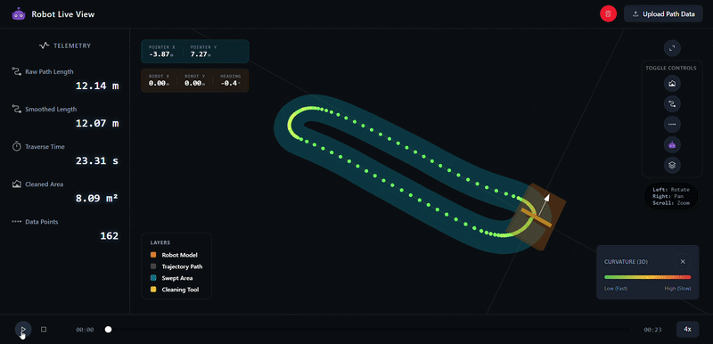
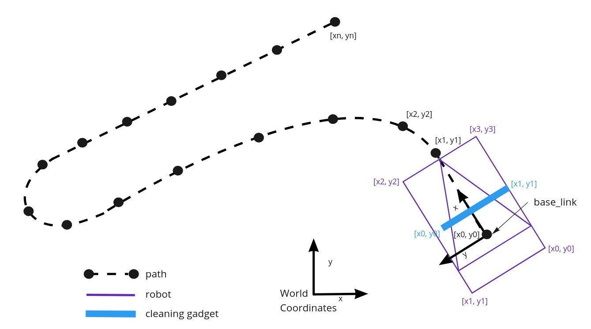
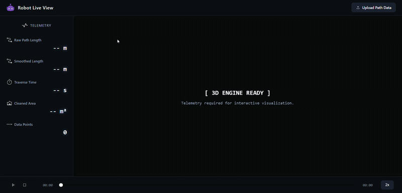
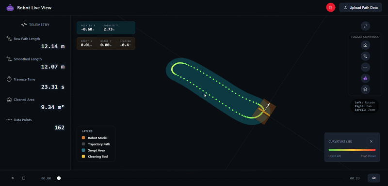

<div align="center">
  
  <h1>Robot Live View Dashboard</h1>
  <p>A high-fidelity 3D WebGL visualization and kinematics analysis tool for autonomous robotic paths.</p>
  
</div>

<p align="center">
  
  
  
  
  
</p>


## 📋 Table of Contents

- [📖 Overview](#overview)
- [✨ Key Features](#key-features)
- [📐 Kinematic Velocity Profiling](#kinematic-velocity-profiling)
- [🤖 Robot Geometry & Coordinate System](#robot-geometry-system)
- [📦 Expected Telemetry Format](#telemetry-format)
- [🚀 Installation & Usage](#installation-usage)
- [🎮 How to Use the Application](#how-to-use)
- [🛠️ Stack Architecture](#stack-architecture)


## <a id="overview"></a>📖 Overview

The **Robot Live View Dashboard** is an interactive telemetry visualizer built with Vue 3 and Three.js. It allows robotics engineers to upload a raw telemetry JSON file containing a recorded or planned path, and instantly visualize the dynamic movement, physical footprints, and kinematic properties of the robot as it traverses the route.

The dashboard not only animates the robot in 3D space but also mathematically derives important real-world operational metrics—such as curvature, traversal time, and the physical square-meter area cleaned by the robot's attachable gadgets.

<p align="center">
  
</p>


## <a id="key-features"></a>✨ Key Features

- **🎮 3D WebGL Visualization**: Smooth playback animation of the robot's true orientation using forward-looking angle interpolation.
- **📈 Advanced Kinematic Profiling**: Automatically calculates target traversal velocity along a path, accounting for hardware limits.
- **🧹 Swept Area Generation**: Computes the true 2D bounding footprint generated by the robot. Useful for verifying "cleaned space" or analyzing collision boundaries using Turf.js.
- **🧮 Intelligent Path Smoothing**: Uses Chaikin's Corner-Cutting (B-Splines) and moving averages to erase high-frequency floating point sensor "jitter" from your data.
- **📊 Real-time Analytical Metrics**: Live sidebar readouts of smoothed path length, estimated traversal time, and metric area coverage using the Shoelace formula. 
- **🐳 Production Ready**: Fully shipped with multi-stage Docker configurations, serving static files efficiently on an Nginx alpine cluster.


## <a id="kinematic-velocity-profiling"></a>📐 Kinematic Velocity Profiling

To ensure realistic traversal, the dashboard calculates a dynamic velocity profile based on path curvature $\kappa$. The robot maintains maximum speed on straights and decelerates linearly as it enters sharper curves to maintain stability.

The target velocity $v(\kappa)$ is defined by the following piecewise function:

$$
v(\kappa) = 
\begin{cases} 
v_{max} & , \kappa < \kappa_{crit} \\
v_{max} - \frac{v_{max} - v_{min}}{\kappa_{max} - \kappa_{crit}}(\kappa - \kappa_{crit}) & , \kappa_{crit} \le \kappa < \kappa_{max} \\
v_{min} & , \kappa \ge \kappa_{max} 
\end{cases}
$$

**Operational Parameters:**
- **Critical Curvature ($\kappa_{crit}$)**: $0.5 \, m^{-1}$ (Threshold where deceleration begins)
- **Maximum Curvature ($\kappa_{max}$)**: $10 \, m^{-1}$ (Point of minimum velocity)
- **Velocity Range**: $0.15 \, m/s$ ($v_{min}$) to $1.1 \, m/s$ ($v_{max}$)


## <a id="robot-geometry-system"></a>🤖 Robot Geometry & Coordinate System

The application maps local robot coordinates to absolute world coordinates. The diagram below illustrates the relationship between the path, the robot's physical base link, and the cleaning gadget attachment.

<p align="center">
  
</p>

- **Path**: Discrete sets of world coordinates $[x_n, y_n]$.
- **Robot Base**: A local polygon centered at the base link.
- **Cleaning Gadget**: An offset tool footprint attached to the robot.


## <a id="telemetry-format"></a>📦 Expected Telemetry Format

The Application accepts `.json` files representing the robot's geometry and traversal route. 

All arrays denote Cartesian points `[x, y]` mapped in standard **Meters**.

```json
{
  "path": [               // Absolute World Coordinates
    [0.0, 0.0],
    [0.1, 0.0],
    [0.1, 0.5]
  ],
  "robot": [              // Local Coordinates (Robot Footprint)
    [-0.3, -0.3],
    [ 0.3, -0.3],
    [ 0.3,  0.3],
    [-0.3,  0.3]
  ],
  "cleaning_gadget": [   // Local Coordinates (Tool/Sweeper Footprint)
    [ 0.3, -0.2],
    [ 0.4, -0.2],
    [ 0.4,  0.2],
    [ 0.3,  0.2]
  ]
}
```


## <a id="installation-usage"></a>🚀 Installation & Usage

You can launch the Dashboard directly using Native Node tools or run it portably inside Docker.

### Option A: Docker Deployment (Recommended)

Great for quickly booting the exact production image without managing Node versions. This builds the static Vue SPA locally and boots a lightweight Nginx webserver container.

**Prerequisites**: Docker Desktop or Docker-Compose

```bash
# 1. Build and boot the Application in detached mode
docker compose up -d --build
```
> Navigate to `http://localhost:8080`

When you are done, shut down the cluster and clean up the network context using:
```bash
docker compose down
```

### Option B: Local Development (Node.js)

Great for making code modifications and testing with Vue's instant Hot Module Replacement (HMR).

**Prerequisites**: Node v18+

```bash
# 1. Install project dependencies
npm install

# 2. Start the Vite development server
npm run dev
```
> Navigate to `http://localhost:5173`


## <a id="how-to-use"></a>🎮 How to Use the Application

Welcome to the Robot Live View Dashboard! Here is a comprehensive guide to understanding the interface and operating the application.

### 1. Uploading a Telemetry Data File
When you launch the app, the first step is to load a telemetry configuration.
- Click on the **Upload JSON** or **Load File** button prominently displayed.
- Select a valid `.json` telemetry file from your local machine (refer to the **Expected Telemetry Format** section to ensure your file contains the required `path`, `robot`, and `cleaning_gadget` arrays).
- Once the file is processed, the dashboard will instantaneously render the 3D scene, perform kinematic calculations, and begin animating the robot's trajectory.



### 2. Dashboard Navigation & Scene Interaction
The primary interface consists of an immersive 3D canvas alongside an analytical sidebar. You can interact freely with the 3D environment:
- **Rotate Camera**: Left-click and drag anywhere on the scene to rotate around the environment.
- **Pan Camera**: Right-click and drag (or Shift + Left-click and drag) to translate your view across the ground plane.
- **Zoom**: Use your mouse scroll wheel to zoom in and out for a closer look at the robot’s path.
- **Live Coordinate Tooltip**: Hover your mouse cursor over the 3D base grid, and a dynamic tooltip will follow your cursor, displaying the precise `(X, Y)` Cartesian coordinates of the ground plane at that location.

### 3. Sidebar Metrics & Real-Time Observations
On the side of the screen, you will find a metrics panel that provides deep insights into the current run:
- **Estimated Traversal Time**: The calculated duration required for the robot to complete its path, derived from realistic velocity and acceleration profiling constraints.
- **Path Length (Smoothed)**: The total physical distance of the resulting cleaned trajectory.
- **Total Area Covered**: The combined geometric footprint (in square meters) swept by the cleaning gadget.
- **Live Feedback**: As the 3D animation plays, real-time gauges may reflect the robot's current step, velocity, or heading.

### 4. Visibility Control Toggles
The dashboard provides a suite of toggle controls that let you customize what you are visualizing, ensuring you can focus cleanly on specific analytical elements:
- **Show Path**: Toggles the visibility of the actual trajectory spline drawn in the environment.
- **Show Robot Base**: Toggles the rendering of the robot chassis mesh footprint.
- **Show Swept Area (Cleaning Path)**: Toggles the generated 2D polygon footprint representing the total area cleaned by the tool attachment throughout the run.
- **Show Grid/Axes**: Toggles the reference Cartesian ground grid and orientation axes to declutter the scene.




## <a id="stack-architecture"></a>🛠️ Stack Architecture

- **Core**: Vue 3 (Composition API) + TypeScript
- **State Management**: Pinia (Reactive Store Singletons)
- **3D Engine**: Three.js + `requestAnimationFrame` interpolation.
- **Geometric Math**: Turf.js (Polygon Union) 
- **Bundler**: Vite
- **Deployment**: Next-gen Docker Compose (Multi-stage `node-alpine` ➡️ `nginx-alpine`)